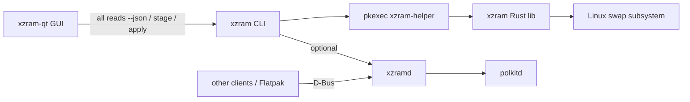

# XZram Qt6 GUI and D-Bus Daemon

## Overview

XZram ships a Qt6 desktop GUI (`xzram-qt`) that shells out to the `xzram` CLI for
every read and mutation. The system D-Bus daemon (`xzramd`) remains available for
other clients and Flatpak; it is **optional** for the native GUI.

Privileged operations go through `xzram` → `xzram-helper` (pkexec/polkit).

## Architecture



## Components

### xzramd (Rust D-Bus daemon)

Optional privileged service for non-CLI clients.

- **Bus name:** `io.github.XZram1`
- **Object path:** `/io/github/XZram`
- **Interface:** `io.github.XZram.Manager`
- **Implementation:** `zbus` + `zbus_polkit` crates
- **Install path:** `/usr/libexec/xzramd`
- **systemd unit:** `xzramd.service` (Type=dbus, BusName=io.github.XZram1)

### D-Bus API

Still exposed by `xzramd` for Flatpak and external tools:

```
GetStatus() -> a{sv}           # StatusReport as JSON
GetDetection() -> a{sv}        # DetectionReport
RunDoctor() -> a{sv}           # DoctorReport
GetZramConfig() -> a{sv}       # ZramConfig (or null)
ListSwapfiles() -> a{sv}       # SwapfileConfig[]
ListSwaps() -> a{sv}           # merged active + fstab partition swaps
GetSysctl() -> a{sv}           # SysctlValues
GetPending() -> a{sv}          # PendingConfig (or null)
ConfigureZram(s config)        # polkit: io.github.xzram.zram.configure
DisableZram()                  # polkit: io.github.xzram.zram.disable
CreateSwapfile(s path, t size) # polkit: io.github.xzram.swapfile.create
RemoveSwapfile(s path)         # polkit: io.github.xzram.swapfile.remove
SetSysctl(a{sv} values)        # polkit: io.github.xzram.sysctl.set
Apply()                        # polkit: io.github.xzram.apply
Rollback()                     # polkit: io.github.xzram.rollback
```

### xzram-qt (C++20 / Qt6)

- **Framework:** Qt6 Widgets (no Qt D-Bus dependency)
- **Backend:** `XzramCli` runner — `xzram <cmd> --json` for reads; stage/apply/mutate via the same verbs as the CLI
- **Binary resolution:** `PATH`, or `XZRAM_CLI` env override (e.g. `target/release/xzram`)
- **Pages:**
  - Dashboard (status, memory, detection strip, recommend defaults; auto-refreshed)
  - ZRAM / Swap Files / Sysctl (stage changes; apply via pending banner)
  - Doctor (issues + prepare nodatacow)
  - Snapshot (create/restore/delete/prune; rollback)
  - Settings (auto-refresh interval, confirm-before-apply, prune default; read-only CLI/daemon status)
- **No bottom Refresh / Start daemon / Apply bar** — live metrics via timer; Apply only in pending banner; `xzramd` not required for native GUI
- **Icon:** embedded Qt resource + `hicolor` `io.github.XZram.png`
- **Install:** bundled in native `xzram` package; optional Flatpak (host `xzramd` for sandboxed GUI)

### Snapshot API

GUI uses CLI verbs: `xzram snapshot list|create|restore|delete|prune`.
Daemon still exposes the D-Bus snapshot methods for other clients.

Startup snapshots use trigger `app_open`. See [SNAPSHOTS.md](SNAPSHOTS.md).

## Flatpak strategy

See [FLATPAK.md](FLATPAK.md) for host package requirements and snapshot limitations.

The Flatpak GUI bundle cannot write `/etc` directly. Distribution model:

1. User installs native `xzram` (provides CLI, helper, `xzramd` + polkit policy)
2. User installs Flatpak `io.github.XZram` GUI (when published)
3. Flatpak manifest grants `--talk-name=io.github.XZram1` and `--system-talk-name=io.github.XZram1`
4. Sandboxed GUI talks to host D-Bus daemon; native GUI uses CLI + helper instead

## File layout

```
crates/
  xzramd/              # D-Bus daemon binary
  xzram-cli/           # CLI (--dbus flag optional)
gui/
  xzram-qt/            # Qt6 C++ application (CLI-backed)
  CMakeLists.txt
data/
  io.github.XZram.service
  io.github.XZram.conf   # D-Bus bus policy
  io.github.XZram.desktop
  io.github.XZram.metainfo.xml
```

## Milestones

1. **M1:** `xzramd` with read-only D-Bus methods (status, detect, doctor) — **done**
2. **M2:** Privileged D-Bus methods with polkit gating — **done**
3. **M3:** Qt6 dashboard + zram config page — **done**
4. **M4:** Swap file management page + sysctl page — **done**
5. **M5:** Flatpak manifest + AppStream metadata — **in progress** (manifest present; publish TBD)
6. **M6:** Native GUI CLI-first (daemon optional) — **done**

## Apply recommended defaults

The Dashboard **Apply recommended defaults** button and `xzram defaults recommend|stage|apply` use
hardware-aware profiles documented in [RECOMMENDATIONS.md](RECOMMENDATIONS.md):

| Profile | Trigger | Key settings |
|---------|---------|--------------|
| `conservative` | Default (≥ 4 GiB RAM) | `min(ram/2, 4096)` or `8192` cap at 32+ GiB |
| `performance` | CachyOS | `zram-size = ram`, `zram-resident-limit = ram / 2` |
| `constrained` | &lt; 4 GiB RAM | `min(ram, 4096)`, `lz4` on weak CPUs |

Staged changes may include zram generator config, sysctl tuning, and an overflow
swapfile at `/swap/swapfile` (priority 10, capped at `min(RAM, 8192)` MiB) when no
active or fstab-configured disk swap exists and free space allows. Read-only `/etc`
and immutable OS detection skip all staging. Vendor zram sizes that already evaluate
≥ the recommended formula are not shrunk.

**Apply defaults** applies immediately; **Configure** stages for review. Advisory items
(zswap, hibernation, dual-tier tradeoffs) are informational only and link to
`docs/RECOMMENDATIONS.md` anchors via the `reference` field.

## Dependencies

| Component | Build deps |
|-----------|-----------|
| xzramd | rust, zbus, zbus_polkit, tokio |
| xzram-qt | cmake, qt6-base, qt6-tools |

## Still TODO

- Publish Flatpak / AppStream to a store
- Broader D-Bus integration tests with `zbus` test connections
- Optional Qt UI tests with `QTest`
- CI GUI gate today: `make gui-smoke` (`QT_QPA_PLATFORM=offscreen`)
