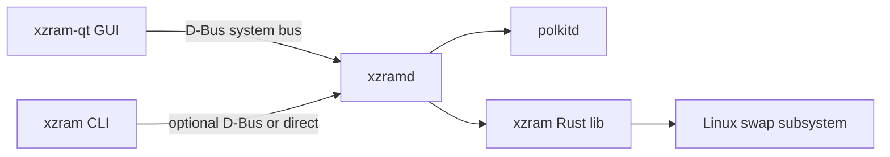

# XZram Phase 2: Qt6 GUI and D-Bus Daemon

## Overview

Once the CLI is stable, phase 2 adds a Qt6 desktop GUI and a system D-Bus daemon
(`xzramd`) so the GUI never needs root or pkexec.

## Architecture



## Components

### xzramd (Rust D-Bus daemon)

- **Bus name:** `io.github.XZram1`
- **Object path:** `/io/github/XZram`
- **Interface:** `io.github.XZram.Manager`
- **Implementation:** `zbus` + `zbus_polkit` crates
- **Install path:** `/usr/libexec/xzramd`
- **systemd unit:** `xzramd.service` (Type=dbus, BusName=io.github.XZram1)

### D-Bus API (draft)

```
GetStatus() -> a{sv}           # StatusReport as JSON
GetDetection() -> a{sv}        # DetectionReport
RunDoctor() -> a{sv}           # DoctorReport
GetZramConfig() -> a{sv}       # ZramConfig (or null)
ListSwapfiles() -> a{sv}       # SwapfileConfig[]
ListSwaps() -> a{sv}           # merged active + fstab partition swaps
GetSysctl() -> a{sv}           # SysctlValues
GetPending() -> a{sv}          # PendingConfig (or null)
ConfigureZram(s config)        # polkit: io.github.xzram.zram.configure
DisableZram()                  # polkit: io.github.xzram.zram.disable
CreateSwapfile(s path, t size) # polkit: io.github.xzram.swapfile.create
RemoveSwapfile(s path)         # polkit: io.github.xzram.swapfile.remove
SetSysctl(a{sv} values)        # polkit: io.github.xzram.sysctl.set
Apply()                        # polkit: io.github.xzram.apply
Rollback()                     # polkit: io.github.xzram.rollback
```

### xzram-qt (C++20 / Qt6)

- **Framework:** Qt6 Widgets or Qt Quick Controls
- **D-Bus client:** `QDBusInterface` to `io.github.XZram1`
- **Pages:**
  - Dashboard (status, memory, compression ratio)
  - ZRAM settings (size formula, algorithm, priority sliders)
  - Swap files (list, create, resize, remove)
  - Sysctl tuning (swappiness, watermarks)
  - Doctor (issue list with severity icons)
  - Utilities (snapshot list + restore; no delete in GUI)
- **Theming:** Fusion style with dark/light toggle (like zram-gui)
- **Install:** bundled in native `xzram` package; optional Flatpak (host `xzramd` required)

### Snapshot D-Bus API

```
ListSnapshots() -> {json}
GetSnapshot(id) -> {json}
CreateSnapshot(trigger, label) -> {json}
RestoreSnapshot(id) -> as (polkit)
DeleteSnapshot(id) (polkit; CLI-oriented)
PruneSnapshots(keep) -> u (polkit; CLI-oriented)
```

Startup snapshots use trigger `app_open`. See [SNAPSHOTS.md](SNAPSHOTS.md).

## Flatpak strategy

See [FLATPAK.md](FLATPAK.md) for host package requirements and snapshot limitations.

The Flatpak GUI bundle cannot write `/etc` directly. Distribution model:

1. User installs native `xzram` package (provides `xzramd` + polkit policy)
2. User installs Flatpak `io.github.XZram` GUI
3. Flatpak manifest grants `--talk-name=io.github.XZram1` and `--system-talk-name=io.github.XZram1`
4. GUI calls host D-Bus daemon; polkit prompts in host session

## File layout (phase 2)

```
crates/
  xzramd/              # D-Bus daemon binary
  xzram-cli/           # existing CLI (add --dbus flag)
gui/
  xzram-qt/            # Qt6 C++ application
  CMakeLists.txt
data/
  io.github.XZram.service
  io.github.XZram.conf   # D-Bus bus policy
  io.github.xzram.desktop
  io.github.XZram.metainfo.xml
```

## Milestones

1. **M1:** `xzramd` with read-only D-Bus methods (status, detect, doctor)
2. **M2:** Privileged D-Bus methods with polkit gating
3. **M3:** Qt6 dashboard + zram config page — **done** (purpose-built widgets, no raw JSON)
4. **M4:** Swap file management page + sysctl page — **done** (staging + CLI fallback)
5. **M5:** Flatpak manifest + AppStream metadata

## Apply recommended defaults

The Dashboard **Apply recommended defaults** button and `xzram defaults recommend|stage|apply` use
hardware-aware profiles documented in [RECOMMENDATIONS.md](RECOMMENDATIONS.md):

| Profile | Trigger | Key settings |
|---------|---------|--------------|
| `conservative` | Default (≥ 4 GiB RAM) | `min(ram/2, 4096)` or `8192` cap at 32+ GiB |
| `performance` | CachyOS | `zram-size = ram`, `zram-resident-limit = ram / 2` |
| `constrained` | &lt; 4 GiB RAM | `min(ram, 4096)`, `lz4` on weak CPUs |

Staged changes may include zram generator config, sysctl tuning, and a RAM-sized overflow
swapfile at `/swap/swapfile` (priority 10) when no disk swap exists. Advisory items (zswap,
hibernation, dual-tier tradeoffs) link to `docs/RECOMMENDATIONS.md` anchors via the `reference`
field in each recommendation item.

## Dependencies (phase 2)

| Component | Build deps |
|-----------|-----------|
| xzramd | rust, zbus, zbus_polkit, tokio |
| xzram-qt | cmake, qt6-base, qt6-tools |

## Testing

- D-Bus integration tests with `zbus` test connections
- Qt UI tests with `QTest` / `squish` (optional)
- CI: build GUI headless with `QT_QPA_PLATFORM=offscreen`
